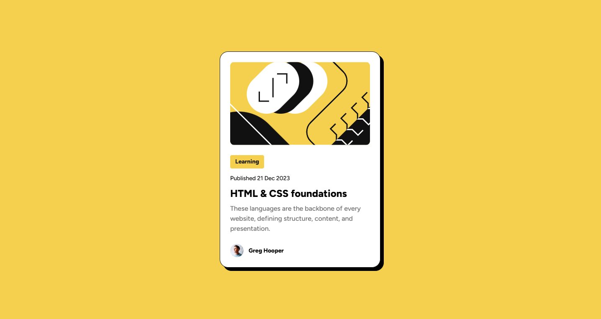
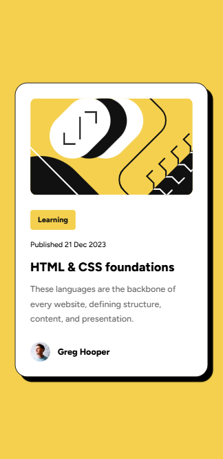

# Blog preview card solution

## Table of contents

- [Overview](#overview)
  - [Screenshots](#screenshots)
  - [Links](#links)
- [My process](#my-process)
  - [Built with](#built-with)
  - [What I learned](#what-i-learned)
- [Author](#author)

## Overview

### Screenshots




### Links

- Solution URL: [Code](https://your-solution-url.com)
- Live Site URL: [BLOG-PREVIEW-CARD-STATIC](https://rinta-git.github.io/BLOG-PREVIEW-CARD-STATIC/)

## My process

### Built with

- Semantic HTML5 markup
- CSS custom properties
- Flexbox
- CSS

### What I learned

Discovering the clamp function in CSS for adjusting font size was a game-changer for me, as it eliminated the necessity for media queries.

see below:

```css
.blog-publish-date{
    font-size: clamp(var(--12px),2vw,var(--fs3));
}
```

## Author

- Website - [Rinta Roy](https://www.linkedin.com/in/rinta-roy)
- Frontend Mentor - [@rinta-git](https://www.frontendmentor.io/profile/rinta-git)
